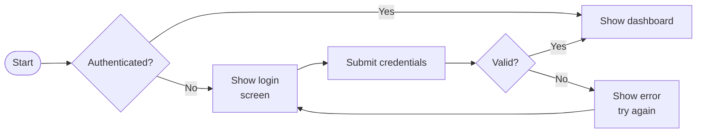
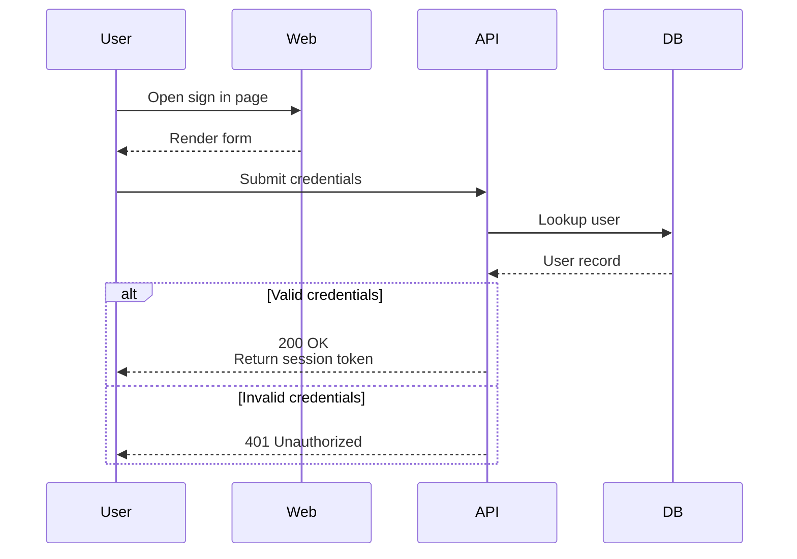

# Mermaid Diagram Creator (Strict Syntax)

This skill helps you create valid Mermaid code that renders reliably across common Mermaid renderers, with a focus on strict label syntax:
- Use `<br />` for line breaks inside labels (never `\\n`).
- Avoid square brackets (`[` and `]`) in any displayed text (node labels, edge labels, notes, titles).

If the user provides existing Mermaid code, you can also repair it while keeping the user's meaning.

## When to use

Use this skill when the user asks for:
- Mermaid diagrams / ` ```mermaid ` code
- Flowcharts, process diagrams, decision trees
- Sequence diagrams (API flows, interactions)
- ERD diagrams (database schemas)
- Class diagrams (domain models)
- State diagrams (state machines)
- Gantt charts (timelines)
- Mindmaps / timelines (concept breakdowns)
- Fixing Mermaid parse errors or "diagram won't render"

## Output contract

1. Prefer to output one Mermaid code block and nothing else:
   - Start with the diagram type on the first line (e.g., `flowchart LR`, `sequenceDiagram`).
   - Keep the code block only Mermaid code (no extra Markdown lists inside it).
2. If the user requests explanation, provide it outside the Mermaid code block.
3. If the user provides content that violates strict rules (e.g., label contains `[`), rewrite the label text to a safe equivalent while preserving intent.

## Strict Mermaid compatibility rules

### 1) Line breaks inside labels

- Never use `\\n` inside any label or note text.
- Use `<br />` instead.

Examples (flowchart labels):
- Good: `A["First line<br />Second line"]`
- Bad: `A["First line\\nSecond line"]`

Examples (sequence notes):
- Good: `Note over A,B: First line<br />Second line`

### 2) No square brackets in displayed text

Mermaid flowchart syntax uses brackets to define shapes. That is fine.

But the displayed text inside labels must not contain literal `[` or `]` because many renderers or parsers treat them as syntax delimiters.

Rules:
- Remove `[` and `]` from all labels, edge labels, notes, titles, and section names.
- Replace with safe alternatives, for example:
  - `Feature [Draft]` -> `Feature (Draft)`
  - `Array index [0..n]` -> `Array index (0..n)`
  - If the bracket meaning is important: use words like `square bracket` or `bracketed`.

### 3) Quote labels consistently

To reduce parse surprises:
- In flowcharts, prefer: `nodeId["Label text"]` (even when plain `nodeId[Label]` would work).
- In decision nodes, prefer: `nodeId{"Label text"}`.
- For edge labels, prefer: `A -->|"Label text"| B`.

Also keep label text simple:
- Avoid double quotes `"` inside label text. If needed, rewrite to single quotes or rephrase.

### 4) Use safe IDs

Use simple, stable IDs:
- Good: `start`, `validateUser`, `db`, `svc1`, `A`, `B`
- Avoid spaces and punctuation in IDs.

When you need readable labels, put readability in the quoted label, not the ID.

### 5) Keep diagrams readable

- Prefer left-to-right (`LR`) for architectures and flows; top-down (`TD`) for decision trees.
- Keep lines short; use `<br />` for deliberate label wrapping.
- Split very complex diagrams into multiple diagrams.

## Workflow for creating a diagram

1. Identify the diagram type
   - Process or branching logic -> `flowchart`
   - Message/order over time -> `sequenceDiagram`
   - Database schema -> `erDiagram`
   - Domain model / OOP -> `classDiagram`
   - Lifecycle/state machine -> `stateDiagram-v2`
   - Timeline with dependencies -> `gantt`
   - Concept map -> `mindmap`

2. Extract structure from the request
   - List actors/components/entities.
   - List main steps and decision points.
   - Identify inputs/outputs and data stores.

3. Draft a minimal diagram first
   - Build the "happy path" before adding edge cases.

4. Apply strict-label sanitization
   - Ensure no label contains `\\n`, `[` or `]`.
   - Convert intended line breaks to `<br />`.

5. Final self-check
   - Diagram type line present.
   - All nodes referenced are defined.
   - No stray characters that look like Mermaid syntax inside label text.
   - Indentation is consistent and readable.

## Quick-start examples

### Flowchart (strict labels)



### Sequence diagram (strict labels)


