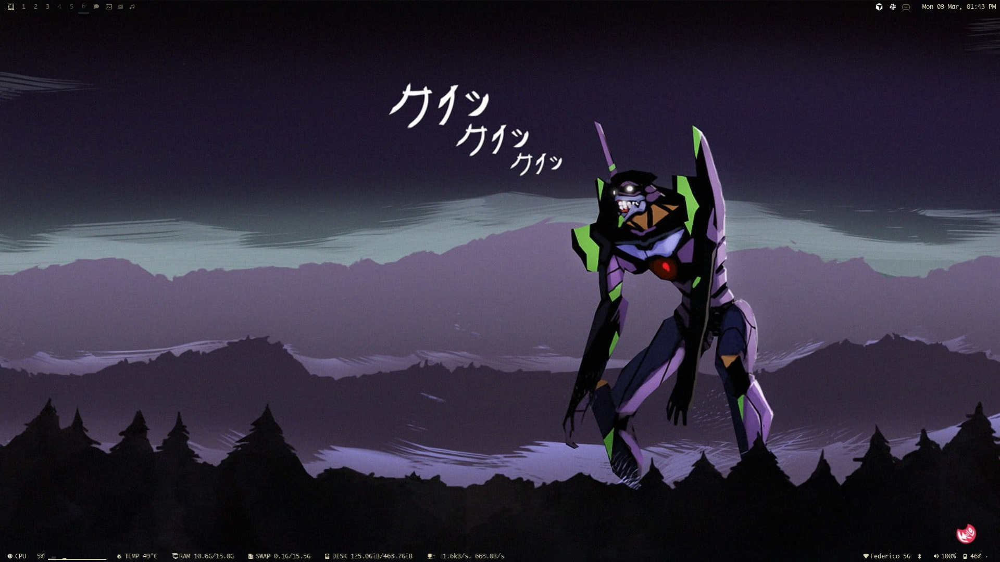
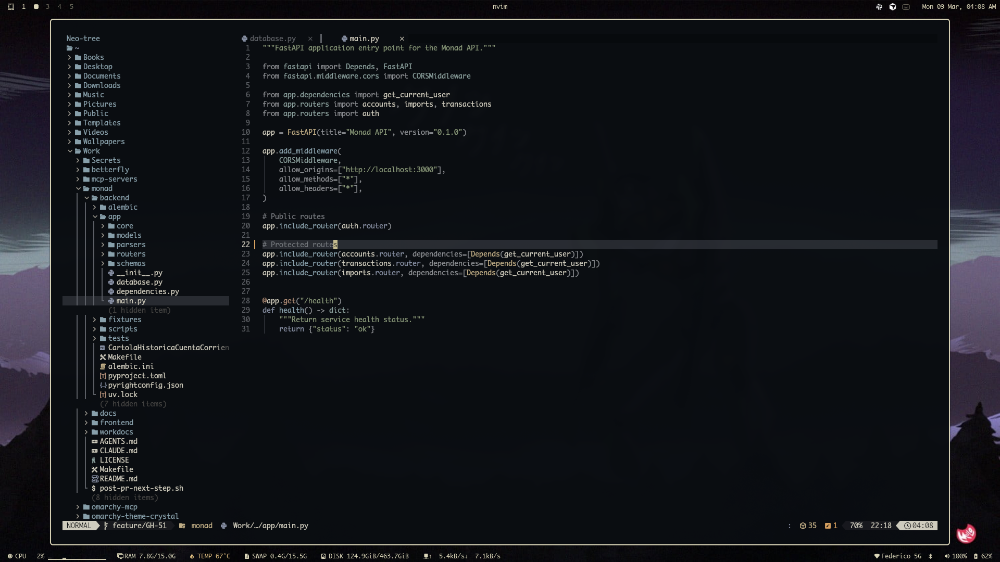
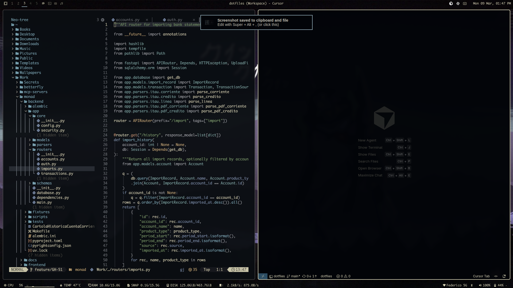

# dotfiles

Personal dotfiles for Arch Linux + [Omarchy](https://omarchy.com). Symlink-managed with `make link`.

Theme: [omarchy-theme-crystal](https://github.com/aldochaconc/omarchy-theme-crystal)





## Stack

| Component | Tool |
|-----------|------|
| WM | Hyprland (Wayland) |
| Bar | Waybar (top + bottom) |
| Notifications | Mako |
| Launcher | Rofi |
| Terminal | Kitty |
| Shell | Zsh + Starship |
| Editor | Neovim (LazyVim) / Cursor |
| Browser | Thorium |

## Perks

- **Vim-style window navigation** — `Super+H/J/K/L` as alternative to arrow keys
- **Named workspaces** — chat, mail, dev, media with persistent icons in waybar; apps auto-route via window rules
- **Workspace overview** — `Super+Space` or 3-finger swipe up/down on trackpad (hyprexpo)
- **3-finger horizontal swipe** — switch workspaces
- **Single-key app launcher** — `Super+Shift+<key>` for every app (W=WhatsApp, S=Slack, M=Music, E=Email, G=GitHub, etc.)
- **Dual waybar** — top bar for workspaces/window/clock, bottom bar for CPU/RAM/temp/disk/network stats
- **Hybrid GPU** — NVIDIA dGPU + AMD iGPU configured for Wayland with env vars in `hypr/envs.conf`
- **Unified color system** — single `colors.toml` in the theme drives terminals, editor, bar, notifications, and all UI

## Keybindings

| Key | Action |
|-----|--------|
| `Super+H/J/K/L` | Focus left/down/up/right |
| `Super+Return` | Terminal (preserves CWD) |
| `Super+Space` | Workspace overview |
| `Super+;` | App launcher (rofi) |
| `Super+Shift+;` | Command runner (rofi) |
| `Super+F` | Full width |
| `Super+Ctrl+F` | Fullscreen |
| `Super+Shift+B` | Browser |
| `Super+Shift+W/S/D` | WhatsApp / Slack / Discord |
| `Super+Shift+E` | Email |
| `Super+Shift+G/H` | GitHub / Graphite |
| `Super+Shift+M/Y` | Music / YouTube |
| `Super+Shift+T` | btop |
| `Super+Shift+N` | Editor |
| `Super+Shift+C` | Cursor |

## Setup

```
git clone https://github.com/aldochaconc/dotfiles ~/.dotfiles
cd ~/.dotfiles
make link
```
