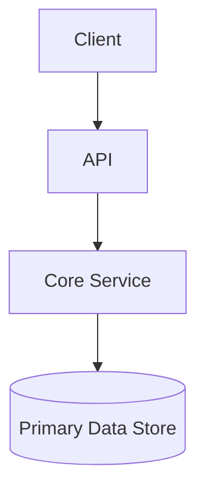

# dotfiles Design Doc

## Purpose

<Why does this project exist? Who is it for?>

## Target Users

- <primary user>
- <secondary user>

## Key User Stories

1. <As a user, I want...>
2. <As a user, I want...>
3. <As a user, I want...>

## In Scope / Out of Scope

**In scope**
- <capability>
- <capability>

**Out of scope**
- <explicitly excluded capability>

## Key Constraints

- <technical or product constraint>
- <regulatory or privacy constraint>

## Architecture

## Data Model & Major Flows

- <main data entities>
- <critical flows>

## Interfaces

- API endpoints: <list or link>
- CLI commands: <list>
- UI routes: <list>
- Events/messages: <list>

## Non-Functional Requirements

- Auth/security:
- Privacy:
- Performance:
- Observability:

## Phased Plan

### Phase 1 — <name>
- Goal: <objective>
- Deliverables: <list>

### Phase 2 — <name>
- Goal: <objective>
- Deliverables: <list>

### Future Phases
- <optional roadmap items>

## Decisions Log

| Date | Decision | Alternatives | Rationale | Consequences |
|------|----------|--------------|-----------|--------------|
| YYYY-MM-DD | <decision summary> | <alternatives> | <why> | <impact> |
