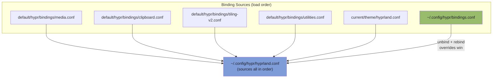

# Hyprland Binding Map

Complete binding reference for crystal's Hyprland setup (Omarchy defaults + user overrides).

## Dependency Diagram

## Modifier Layers

```mermaid
graph TB
    subgraph SUPER["SUPER + Key (Primary Layer)"]
        direction LR
        subgraph nav["Navigation (Vim)"]
            H["H - Focus left"]
            J["J - Focus down"]
            K["K - Focus up"]
            L["L - Focus right"]
        end
        subgraph wm["Window Management"]
            W["W - Close window"]
            T["T - Toggle float/tile"]
            F["F - Full width"]
            P["P - Pseudo window"]
            O["O - Pop out (float+pin)"]
            G["G - Toggle group"]
            S["S - Scratchpad"]
        end
        subgraph ws["Workspaces"]
            N1["1-0 - Switch workspace 1-10"]
            TAB["TAB - Next workspace"]
            STAB["SHIFT+TAB - Prev workspace"]
            CTAB["CTRL+TAB - Last workspace"]
        end
        subgraph launch["Launch"]
            SPACE["SPACE - Walker (apps)"]
            RET["RETURN - Terminal (cwd)"]
            ESC["ESCAPE - System menu"]
        end
        subgraph misc["Misc"]
            C["C - Copy (universal)"]
            V["V - Paste (universal)"]
            X["X - Cut (universal)"]
            COMMA["COMMA - Dismiss notif"]
            BKSP["BKSP - Toggle transparency"]
            SLASH["/ - Cycle monitor scale"]
        end
    end

    subgraph SHIFT["SUPER + SHIFT (App Launcher Layer)"]
        direction LR
        subgraph apps["Applications"]
            SB["B - Browser"]
            SS["S - Slack"]
            SM["M - Spotify"]
            SN["N - Editor (nvim)"]
            SF["F - Nautilus"]
            ST["T - btop"]
            SD["D - Lazydocker"]
            SG["G - GitHub"]
            SH_["H - Graphite"]
        end
        subgraph comms["Communication"]
            SC["C - Calendar"]
            SE["E - Email"]
            SW["W - WhatsApp"]
        end
        subgraph web["Web Apps"]
            SA["A - ChatGPT"]
            SY["Y - YouTube"]
        end
    end

    subgraph CTRL["SUPER + CTRL (System/Control Layer)"]
        direction LR
        subgraph panels["Panels"]
            CA["A - Audio"]
            CB["B - Bluetooth"]
            CW["W - WiFi"]
            CT["T - Activity (btop)"]
        end
        subgraph toggles["Toggles"]
            CI["I - Lock on idle"]
            CN["N - Nightlight"]
            CL["L - Lock screen"]
            CZ["Z - Zoom in"]
        end
    end

    subgraph ALT_LAYER["SUPER + ALT (Advanced)"]
        direction LR
        AF["F - True fullscreen"]
        AS["S - Move to scratchpad"]
        ASPACE["SPACE - Omarchy menu"]
        AG["G - Ungroup window"]
    end

    style nav fill:#7e9cd8,color:#1f1f28
    style wm fill:#957fb8,color:#1f1f28
    style ws fill:#76946a,color:#1f1f28
    style launch fill:#c0a36e,color:#1f1f28
    style apps fill:#c34043,color:#dcd7ba
    style comms fill:#6a9589,color:#1f1f28
    style panels fill:#98bb6c,color:#1f1f28
    style toggles fill:#7fb4ca,color:#1f1f28
```

## Full Reference Tables

### SUPER + Key

| Key | Action | Source |
|-----|--------|--------|
| `H` | Focus left | **override** (was: nothing) |
| `J` | Focus down | **override** (was: toggle split) |
| `K` | Focus up | **override** (was: show keybindings) |
| `L` | Focus right | **override** (was: toggle layout) |
| `arrows` | Focus direction | default (redundant with HJKL) |
| `W` | Close window | default |
| `T` | Toggle float/tile | default |
| `F` | Full width | **override** (was: fullscreen) |
| `P` | Pseudo window | default |
| `O` | Pop out (float+pin) | default |
| `G` | Toggle group | default |
| `S` | Scratchpad | default |
| `1-0` | Switch workspace | default |
| `TAB` | Next workspace | default |
| `SPACE` | Walker (apps) | default |
| `RETURN` | Terminal (cwd) | **user** |
| `ESCAPE` | System menu | default |
| `C/V/X` | Copy/Paste/Cut | default |
| `,` | Dismiss notification | default |
| `BKSP` | Toggle transparency | default |
| `/` | Cycle monitor scale | default |
| `-/=` | Resize window horizontal | default |

### SUPER + SHIFT + Key

| Key | Action | Source |
|-----|--------|--------|
| `B` | Browser (Thorium) | **user** |
| `S` | Slack | **user** |
| `M` | Spotify | **user** |
| `N` | Editor (nvim) | **user** |
| `F` | Nautilus | **user** |
| `T` | btop | **user** |
| `D` | Lazydocker | **user** |
| `G` | GitHub | **user** |
| `H` | Graphite | **user** |
| `C` | Calendar | **user** |
| `E` | Email | **user** |
| `W` | WhatsApp | **user** |
| `A` | ChatGPT | **user** |
| `Y` | YouTube | **user** |
| `1-0` | Move window to WS | default |
| `arrows` | Swap window | default |
| `TAB` | Prev workspace | default |
| `SPACE` | Toggle waybar | default |
| `BKSP` | Toggle gaps | default |
| `,` | Dismiss all notifs | default |
| `-/=` | Resize window vertical | default |

### SUPER + CTRL + Key

| Key | Action |
|-----|--------|
| `A` | Audio panel |
| `B` | Bluetooth |
| `W` | WiFi |
| `T` | btop (activity) |
| `F` | Tiled fullscreen |
| `L` | Lock screen |
| `I` | Toggle idle lock |
| `N` | Toggle nightlight |
| `E` | Emoji picker |
| `C` | Capture menu |
| `O` | Toggle menu |
| `S` | Share menu |
| `V` | Clipboard history |
| `X` | Dictation |
| `Z` | Zoom in |
| `SPACE` | Background menu |
| `BKSP` | Square aspect toggle |
| `TAB` | Last workspace |

### SUPER + ALT + Key

| Key | Action |
|-----|--------|
| `F` | True fullscreen |
| `S` | Move to scratchpad |
| `G` | Ungroup window |
| `SPACE` | Omarchy menu |
| `arrows` | Join group |
| `TAB` | Next in group |
| `1-5` | Group window by # |

### SUPER + SHIFT + ALT + Key

| Key | Action |
|-----|--------|
| `1-0` | Move window silently to WS |
| `arrows` | Move workspace to monitor |
| `B` | Browser (private) |

### SUPER + SHIFT + CTRL

| Key | Action |
|-----|--------|
| `SPACE` | Theme menu |
| `N` | Cursor editor |

### No SUPER (Media/System)

| Key | Action |
|-----|--------|
| `PrtSc` | Screenshot |
| `ALT+PrtSc` | Screen record |
| `ALT+TAB` | Cycle windows |
| `CTRL+ALT+DEL` | Close all windows |
| Media keys | Volume/Brightness/Playback |

### Mouse

| Combo | Action |
|-------|--------|
| `SUPER + scroll` | Scroll workspaces |
| `SUPER + LMB drag` | Move window |
| `SUPER + RMB drag` | Resize window |
| `SUPER + ALT + scroll` | Scroll group windows |

## Lost Defaults (Overridden, No Replacement)

| Original Key | Action | Notes |
|-------------|--------|-------|
| `SUPER+J` | Toggle split | Switches dwindle split direction |
| `SUPER+K` | Show keybindings | Opens keybinding cheat sheet |
| `SUPER+L` | Toggle workspace layout | Switches dwindle/master |

## Design Pattern

The modifier system follows a consistent mental model:

- **SUPER** = primary actions (navigate, manage windows)
- **SUPER+SHIFT** = app launching (mnemonic letters)
- **SUPER+CTRL** = system panels and toggles
- **SUPER+ALT** = advanced/secondary variants
- **SUPER+SHIFT+ALT** = silent/monitor-level operations
