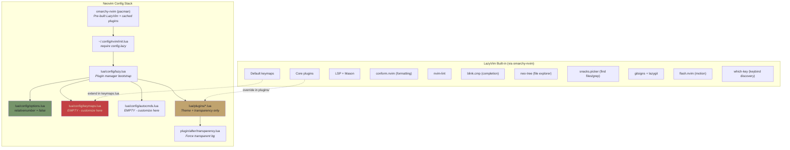

# Neovim Migration Map: Cursor → LazyVim

## Current State

**Cursor**: Daily driver with custom keybindings, Prettier/ESLint formatting, AI composer.
**Neovim**: Stock LazyVim (omarchy-nvim) + kanagawa theme + transparency. No custom keymaps.

## Architecture



## Cursor → LazyVim Keybinding Map

Leader key in LazyVim = `<Space>`. Press it and wait — which-key shows all options.

### What You Use in Cursor → Neovim Equivalent

| Cursor Keybinding | What it does | LazyVim Equivalent | Notes |
|---|---|---|---|
| `ctrl+p` | Quick open file | `<leader>ff` or `<leader><leader>` | snacks.picker find_files |
| `ctrl+shift+p` | Command palette | `<leader>:` | Command history (`:` for direct) |
| `ctrl+shift+f` | Search in files | `<leader>sg` | Live grep |
| `ctrl+shift+e` | Explorer sidebar | `<leader>e` | Neo-tree toggle |
| `ctrl+b` | Toggle sidebar | `<leader>e` | Neo-tree toggle |
| `ctrl+\`` | Toggle terminal | `<c-/>` | Snacks terminal |
| `ctrl+shift+\`` | New terminal | `:terminal` | Or `<c-/>` opens float |
| `ctrl+,` | Settings | `:e $MYVIMRC` | Or edit lua/config/options.lua |
| `ctrl+s` | Save | Built-in (`:w`) | LazyVim auto-saves on focus lost |
| `ctrl+z` | Undo | `u` | Vim native |
| `ctrl+shift+z` | Redo | `<c-r>` | Vim native |
| `ctrl+/` | Toggle comment | `gc` (visual) / `gcc` (line) | ts-comments.nvim |
| `ctrl+d` | Select word/next occurrence | `*` (search word) or flash.nvim | See flash.nvim section |
| `ctrl+shift+k` | Delete line | `dd` | Vim native |
| `ctrl+shift+d` | Duplicate line | `yyp` | Yank + paste |
| `ctrl+shift+[` / `]` | Fold/unfold | `za` | See folding section |
| **`alt+\``** | **Toggle fold** | **`za`** | **Your custom bind** |
| **`shift+alt+\``** | **Toggle fold recursive** | **`zA`** | **Your custom bind** |
| `ctrl+i` | Cursor AI composer | N/A | See AI integration section |
| `ctrl+shift+r` | ChatGPT sidebar | N/A | See AI integration section |
| `ctrl+g` | Go to line | `:<number>` or `<number>G` | Vim native |
| `f12` | Go to definition | `gd` | LSP |
| `shift+f12` | Go to references | `gr` | LSP |
| `f2` | Rename symbol | `<leader>cr` | LSP |
| `ctrl+.` | Code action | `<leader>ca` | LSP |
| `ctrl+space` | Trigger autocomplete | Auto (blink.cmp) | Always active |
| `ctrl+shift+m` | Problems panel | `<leader>xx` | Trouble diagnostics |
| `alt+up/down` | Move line | `alt+j` / `alt+k` | LazyVim default |
| `ctrl+shift+\` ` | Split terminal | `<leader>\|` / `<leader>-` | Window splits |
| Format on save | Prettier/ESLint | conform.nvim | Needs config (see below) |

### Folding (Your Priority)

Neovim folding with treesitter (already available):

| Action | Vim Key | Cursor Equivalent |
|--------|---------|-------------------|
| Toggle fold at cursor | `za` | `alt+\`` (your custom) |
| Toggle fold recursive | `zA` | `shift+alt+\`` (your custom) |
| Open fold | `zo` | `ctrl+shift+]` |
| Close fold | `zc` | `ctrl+shift+[` |
| Open all folds | `zR` | `ctrl+k ctrl+j` |
| Close all folds | `zM` | `ctrl+k ctrl+0` |
| Open folds to level N | `z{N}` (e.g. `z2`) | ctrl+k ctrl+{N} |
| Peek fold (without opening) | `zK` (LazyVim) | Hover preview |

LazyVim uses treesitter-based folding by default. To enable it explicitly, add to options.lua:
```lua
vim.opt.foldmethod = "expr"
vim.opt.foldexpr = "v:lua.vim.treesitter.foldexpr()"
vim.opt.foldlevel = 99  -- start with all folds open
```

### Navigation (The Big Win)

This is where Neovim destroys Cursor. Learn progressively:

**Phase 1 — Basics (Week 1)**
| Action | Key | Cursor Equivalent |
|--------|-----|-------------------|
| Move by word | `w` / `b` / `e` | `ctrl+left/right` |
| Start/end of line | `0` / `$` | `home` / `end` |
| Top/bottom of file | `gg` / `G` | `ctrl+home` / `ctrl+end` |
| Page up/down | `<c-u>` / `<c-d>` | `pgup` / `pgdn` |
| Search in file | `/pattern` | `ctrl+f` |
| Next/prev search | `n` / `N` | `f3` / `shift+f3` |

**Phase 2 — Motions (Week 2)**
| Action | Key | Why |
|--------|-----|-----|
| Jump to character | `f{char}` / `F{char}` | Like ctrl+f but instant |
| Flash jump (any visible text) | `s` | flash.nvim — type 2 chars, jump anywhere |
| Go to matching bracket | `%` | Matches `()`, `{}`, `[]` |
| Jump to previous position | `<c-o>` | Like browser back |
| Jump to next position | `<c-i>` | Like browser forward |

**Phase 3 — Leader Menu (Week 3)**
Just press `<Space>` and read which-key. Key trees:

```
<leader>f  → Find (files, grep, buffers, recent)
<leader>s  → Search (grep, help, keymaps, symbols)
<leader>g  → Git (lazygit, blame, hunks)
<leader>c  → Code (actions, rename, format)
<leader>x  → Diagnostics (trouble)
<leader>b  → Buffers (close, pick, pin)
<leader>w  → Windows (split, close, resize)
<leader>u  → UI toggles (numbers, wrap, format-on-save)
<leader>q  → Quit/Session
```

**Phase 4 — Text Objects (Week 4)**
The killer feature Cursor doesn't have:

| Action | Key | What it does |
|--------|-----|--------------|
| Change inside quotes | `ci"` | Deletes content between `"` and enters insert |
| Delete around parens | `da(` | Deletes including the `()` |
| Yank inside function | `yif` | Copies function body (treesitter) |
| Select around class | `vac` | Visual select entire class (treesitter) |
| Change inside tag | `cit` | Change HTML tag content |

mini.ai + treesitter-textobjects give you `if` (function), `ic` (class), `ia` (argument), etc.

## What Needs Configuration for Parity

### 1. Formatting (Prettier + ESLint)

Your Cursor does format-on-save with Prettier + ESLint. Add to `lua/plugins/formatting.lua`:

```lua
return {
  {
    "stevearc/conform.nvim",
    opts = {
      formatters_by_ft = {
        javascript = { "prettierd" },
        typescript = { "prettierd" },
        javascriptreact = { "prettierd" },
        typescriptreact = { "prettierd" },
        json = { "prettierd" },
        jsonc = { "prettierd" },
        yaml = { "prettierd" },
        markdown = { "prettierd" },
        sh = { "shfmt" },
        bash = { "shfmt" },
      },
    },
  },
}
```

### 2. LSP Servers (Match Cursor Extensions)

Add to `lua/plugins/lsp.lua` to match your Cursor extension stack:

```lua
return {
  -- Import LazyVim extras for your languages
  { import = "lazyvim.plugins.extras.lang.typescript" },
  { import = "lazyvim.plugins.extras.lang.python" },
  { import = "lazyvim.plugins.extras.lang.go" },
  { import = "lazyvim.plugins.extras.lang.rust" },
  { import = "lazyvim.plugins.extras.lang.json" },
  { import = "lazyvim.plugins.extras.lang.yaml" },
  { import = "lazyvim.plugins.extras.lang.prisma" },
  { import = "lazyvim.plugins.extras.lang.docker" },
  { import = "lazyvim.plugins.extras.lang.markdown" },
}
```

### 3. AI Integration

Cursor's AI features don't have a 1:1 nvim equivalent, but options exist:

| Cursor Feature | Neovim Option |
|---|---|
| Composer (ctrl+i) | Claude Code in terminal (`<c-/>`) |
| Inline edit | Claude Code in split terminal |
| AI autocomplete | Copilot or Supermaven (LazyVim extra) |
| Chat sidebar | Claude Code / Avante.nvim |

### 4. Git Blame (You have waderyan.gitblame in Cursor)

Already built-in via gitsigns. Toggle with `<leader>ub` (blame line).

## Migration Phases (Progressive)

### Phase 0: Orientation (Now)
- Open nvim in a project, press `<Space>` and explore which-key
- Use `<leader>ff` to find files, `<leader>sg` to grep
- Use `<leader>e` for file tree
- Use `<c-/>` for terminal

### Phase 1: Basic Editing (Week 1-2)
- Learn `hjkl`, `w/b`, `0/$`, `gg/G`, `dd`, `yy`, `p`, `u/<c-r>`
- Use `za` for folding (replaces your `alt+\``)
- Use `gcc` for commenting (replaces `ctrl+/`)
- Use `:w` to save (or let auto-save handle it)

### Phase 2: Code Navigation (Week 3-4)
- `gd` (definition), `gr` (references), `K` (hover)
- `<leader>cr` (rename), `<leader>ca` (code action)
- `<leader>xx` (diagnostics)
- `s` for flash.nvim jumps

### Phase 3: Productivity (Month 2)
- Text objects (`ci"`, `da(`, `yif`)
- Configure formatting (conform.nvim)
- Add language extras
- Macros (`q{reg}` to record, `@{reg}` to replay)

### Phase 4: Power User (Month 3+)
- Custom keymaps in keymaps.lua
- Plugin customization
- AI integration
- Fully replace Cursor
